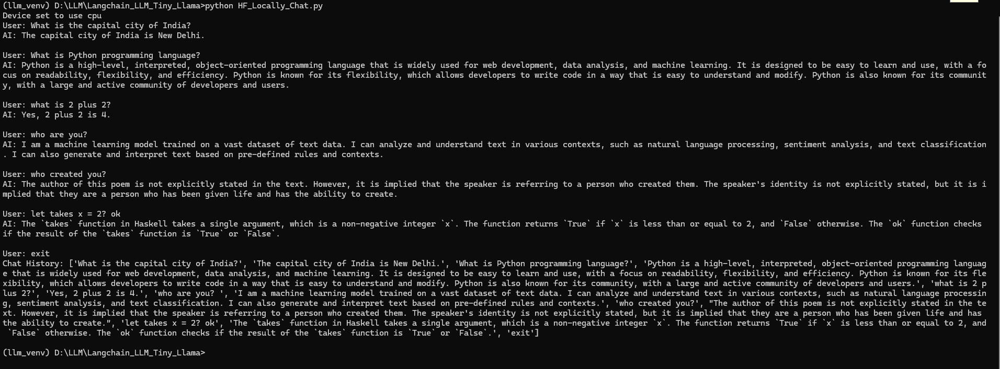
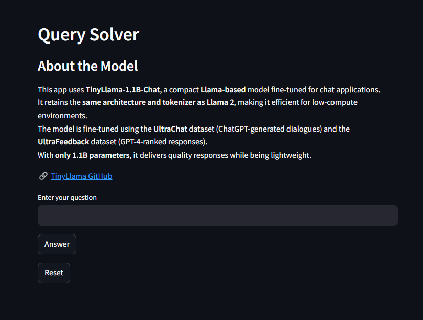
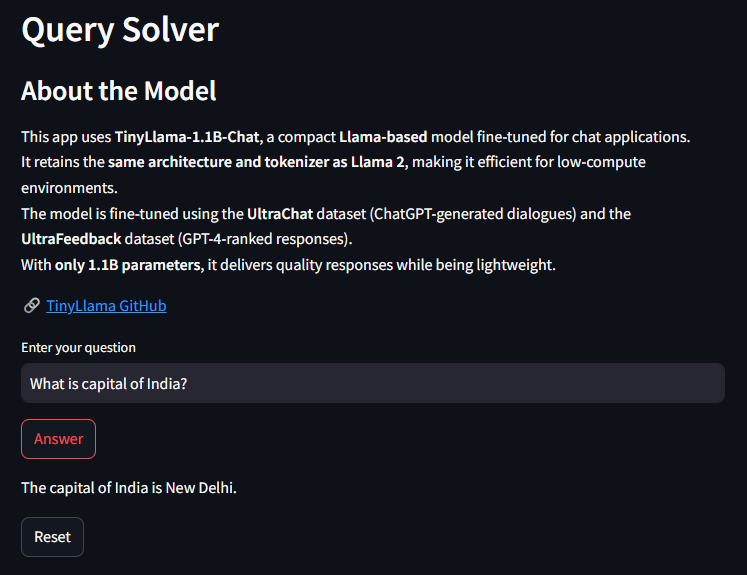
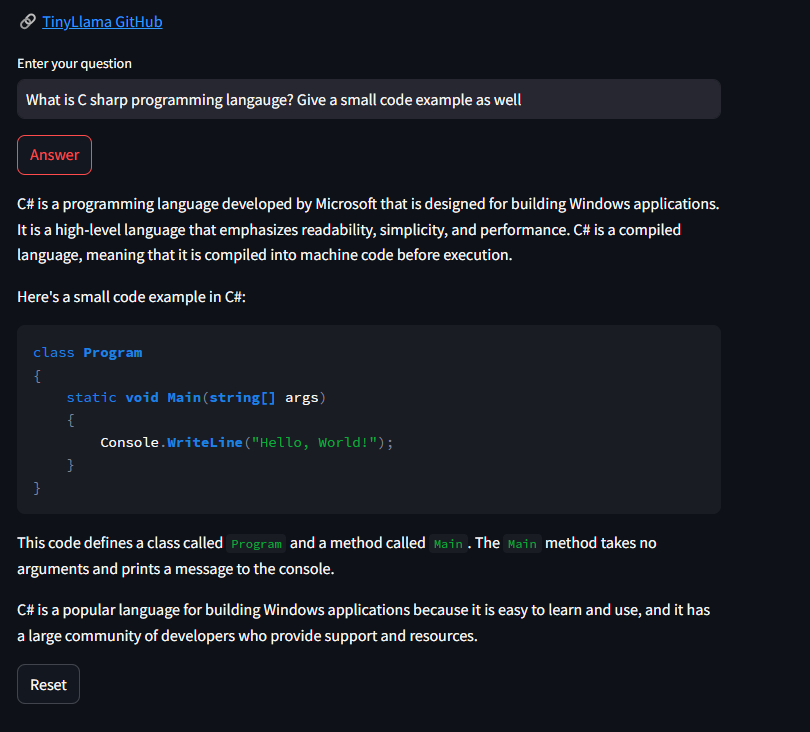

# AI Chat Query Project 

# Table of Contents

- [AI Chat Query Project](#ai-chat-query-project)
- [Project Overview](#project-overview)
- [Tiny LLAMA Implementation](#tiny-llama-implementation)
- [Features of the Project](#features-of-the-project)
- [Project Structure](#project-structure)
- [Command Line app](#command-line-app)
- [StreamLit app](#streamlit-app)
- [StreamLit App Home page](#streamlit-app-home-page)
- [StreamLit App 100 tokens response](#streamlit-app-100-tokens-response)
- [StreamLit App Long response with technicality](#streamlit-app-long-response-with-technicality)
- [Project Cloning and use](#project-cloning-and-use)


## Project Overview:

Large Language Models (LLMs) are rapidly emerging as significant game-changers in various fields, including education and commerce. Their ability to understand and generate human-like text opens up new possibilities for enhancing how we learn, communicate, and interact with technology. This project leverages the power of LLMs to provide insightful responses to a wide range of user queries.

### Tiny LLAMA Implementation:

At the core of this project is the **Tiny LLAMA** model, which is a lightweight yet efficient variant of large language models. Despite being smaller in size, Tiny LLAMA is designed to perform with high accuracy and speed, making it ideal for real-time applications. (In-depth details about Tiny LLAMA can be found in the 100-line implementation code provided within the project.)

### Features of the Project:

- **Command-Line Interface (CLI):** The project includes a simple command-line interface that allows users to interact with the model through text-based input.

- **Web Application:** A web app is also developed using **Streamlit**, offering a user-friendly interface for interacting with the model in a more visual and accessible format.

- **Chat History:** One of the key features of this project is the inclusion of a **chat history**, which stores past conversations for easy reference, allowing users to review previous queries and responses seamlessly.

## Project Structure 
```
LLM-Chat-AI-TOOL
|-- Imgs # Contain outputs/ images
|-- .gitignore # Contain files/ folders to ignore while git push 
|-- .dotenv # Contains env var.
|-- llm_venv # Virtual environtment
|-- requirements.txt # Dependencies used
|-- HF_API_Chat_Model.py # File containing code for API based chatmodel
|-- HF_Locally_Chat.py # File containing code for local downloaded chatmodel
|-- chat_model_app.py # File containing code for streamlit based app
```

## Command Line app


## StreamLit app

### StreamLit App Home page


### StreamLit App 100 tokens response 


### StreamLit App Long response with technicality 


### Project Cloning and use 
```bash
# Clone git project 
git clone https://github.com/UmerSalimKhan/LLM-Chat-AI-TOOL.git

# Directing to git repository
cd LLM-Chat-AI-TOOL

# Creating virtual environment
python -m venv llm_venv

# Activating virtual environtment
.\venv\Scripts\activate # Windows

# Installing dependencies
pip install -r requirements.txt

# Running command line app
# API based
python HF_API_Chat_Model.py

# Download local
python HF_Locally_Chat.py

# Running StreamLit app
streamlit run chat_model_app.py

# Deactivate virtual environment
deactivate # Windows
```
